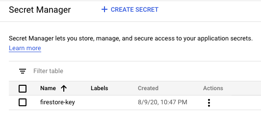
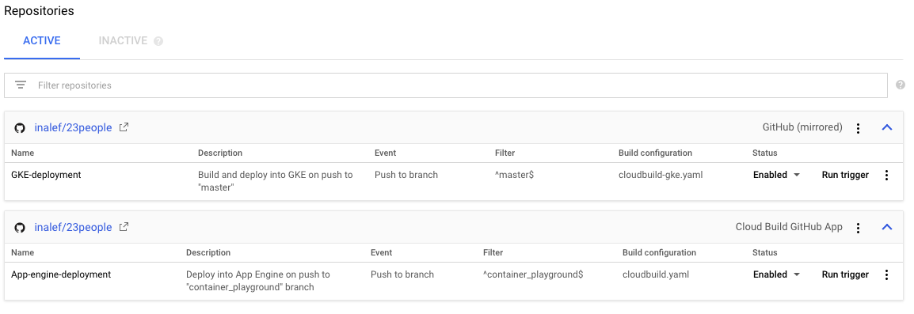
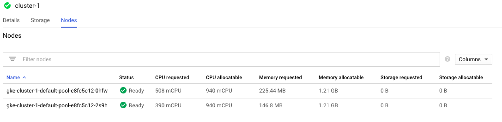
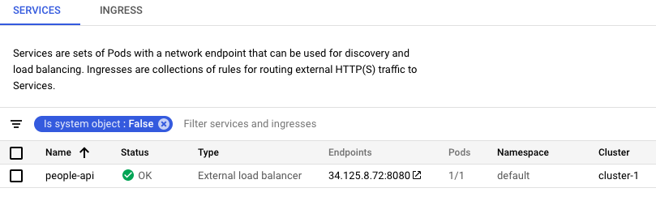

# People registry API Example

> A simple REST API web service developed in Python + Flask, that stores people records, allowing updates, deletes and inserts.

![Python Version][python-image]
![Flask Version][flask-image]

This example uses Flask RESTful (flask_restful) to define the web service entry points. 

```python
#Registering routes into the API handler    
api.add_resource(Person,'/people/<id>')
api.add_resource(PersonList,'/people')
```

[Schema](https://github.com/keleshev/schema) is used to define the correct form for incoming JSON payloads.


```python
from schema import Schema, And, Use, Optional

#Person Schema definition using schema lib from https://github.com/keleshev/schema
schema = Schema({'nationalId': And(str, len),
               Optional('name'): And(str, len),
               Optional('lastName'): And(str, len),
               Optional('age'):  And(Use(int), lambda n: 1 <= n <= 99),
               Optional('originPlanet'): And(str, len),
               Optional('pictureUrl'): And(str, len)
            })
```

Once received and validated, requests are serviced by 2 Resource classes: Person and PersonList.
```python
#Resource class to handle GET, PUT and DELETE calls passing nationalId
class Person(Resource):
    #This method retrieves a single Person document from the collection
    def get(self,id):
    
    #This method updates an existing Person document in the collection
    def put(self,id):
    
    #This method deletes an existing Person document from the collection
    def delete(self,id):


#Resource class to handle GET and POST calls, without providing nationalId
class PersonList(Resource):
    #Just list all items in persons collection
    def get(self):
    
    #Upon receiving a JSON Payload, this method will create a new document with the person information
    def post(self):

```

Person records are stored in a Firestore collection. Since this web service is designed to run in GCP, the following is used to authenticate into GCP in order to gain access to [Google Secret Manager](https://cloud.google.com/secret-manager).

```python
from google.cloud import secretmanager

#Authenticating into GCP, and choosing project
client = secretmanager.SecretManagerServiceClient()
project_id = os.environ["GOOGLE_CLOUD_PROJECT"]
```

Deployments in App Engine have ```GOOGLE_CLOUD_PROJECT``` environment variable already defined. However, deployments in GKE need to define this in their Config Map. For example:

```yaml
apiVersion: v1
data:
  GOOGLE_CLOUD_PROJECT: people-ae72e
kind: ConfigMap
metadata:
  ...
```

With this, Secret Manager can be accessed in order to retrieve the key.json file needed to authenticate into the Firestore database. ```firestore-key``` is the name given to the file stored in Secret Manager.



```python
#Retrieving latest version of Firebase json key file named 'firebase-key' from GCP Secret Manager
name = client.secret_version_path(project_id, "firestore-key", "latest")
response = client.access_secret_version(name)
key = response.payload.data.decode("UTF-8") #storing file contents in key variable
```

And now, Firebase App is initialized, and the Firestore DB accessed.

```python
# Initializing Firebase App with the key retrieved from Secret Manager
cred = credentials.Certificate(json.loads(key))
default_app = initialize_app(cred)

#Accessing Firestore and getting reference to persons document
db = firestore.client()
persons_ref = db.collection('persons')
```

# Automated Deployment 

In the spirit of extending the example, two automatic deployments were configured using GCP Cloud Build:



Both ```cloudbuild.yaml``` and ```cloudbuild-gke.yaml``` are in this repo.

## GKE Deployment
In the image, the first trigger called GKE-deployment will build and deploy in Kubernetes (GKE), automatically when there are pushes into the master branch of this repo. The deployment runs on top of a cluster of 2 Compute Engine VMs, with 1 Kubernete pod in each.



Then, a Load Balancer services the cluster, providing also exposition to the internet:



And the detailed definition (not present in this repo):

```yaml
apiVersion: v1
kind: Service
metadata:
  annotations:
    gcb-build-id: a3a90caf-471e-42ec-9b2a-253a5361daba
    gcb-trigger-id: 7f0b9580-d39b-4b13-90d4-0538571d8ae4
    kubectl.kubernetes.io/last-applied-configuration: |
      {"apiVersion":"v1","kind":"Service","metadata":{"annotations":{"gcb-build-id":"a3a90caf-471e-42ec-9b2a-253a5361daba","gcb-trigger-id":"7f0b9580-d39b-4b13-90d4-0538571d8ae4"},"finalizers":["service.kubernetes.io/load-balancer-cleanup"],"labels":{"app":"people","app.kubernetes.io/managed-by":"gcp-cloud-build-deploy","app.kubernetes.io/name":"people","app.kubernetes.io/version":"7fc7ecde82c4117ec26b80bb3e821d86a30aaa6d"},"name":"people-api","namespace":"default"},"spec":{"clusterIP":"10.126.7.35","externalTrafficPolicy":"Cluster","ports":[{"nodePort":30772,"port":8080,"protocol":"TCP","targetPort":50001}],"selector":{"app":"people"},"sessionAffinity":"None","type":"LoadBalancer"}}
  creationTimestamp: "2020-08-11T01:22:40Z"
  finalizers:
  - service.kubernetes.io/load-balancer-cleanup
  labels:
    app: people
    app.kubernetes.io/managed-by: gcp-cloud-build-deploy
    app.kubernetes.io/name: people
    app.kubernetes.io/version: 7fc7ecde82c4117ec26b80bb3e821d86a30aaa6d
  name: people-api
  namespace: default
  resourceVersion: "210000"
  selfLink: /api/v1/namespaces/default/services/people-api
  uid: 186c5bae-8ad8-477c-8255-5111d2502604
spec:
  clusterIP: 10.126.7.35
  externalTrafficPolicy: Cluster
  ports:
  - nodePort: 30772
    port: 8080
    protocol: TCP
    targetPort: 50001
  selector:
    app: people
  sessionAffinity: None
  type: LoadBalancer
status:
  loadBalancer:
    ingress:
    - ip: 34.125.8.72
```

## App Engine deployment

The second trigger listed before, named ```App-engine-deployment```, will trigger the deployment on pushes into a specific branch. App Engine deployment is very straightforward, as it is easily exposed to the internet using ```gcloud app deploy```. This is given also in ```cloudbuild.yaml``` file present in this repo.


## Meta

Gonzalo Benavides – [LinkedIn](https://www.linkedin.com/in/gonzalobenavides/) – gbenavid@gmail.com
[https://github.com/inalef](https://github.com/inalef/)

<!-- Markdown link & img dfn's -->
[python-image]: https://img.shields.io/badge/python-v3.8-blue
[flask-image]: https://img.shields.io/badge/flask-v1.1.1-blue
